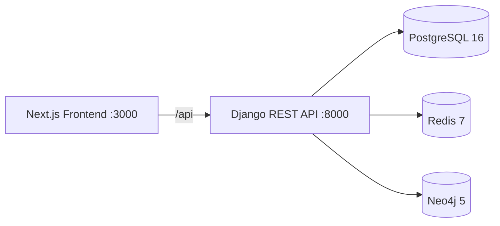

# SecureMed 🏥

[](https://github.com/Anurup-R-Krishnan/SecureMed)
[](https://github.com/Anurup-R-Krishnan/SecureMed)
[](https://opensource.org/licenses/MIT)
[](https://www.djangoproject.com/)
[](https://nextjs.org/)

**SecureMed** is an enterprise-grade healthcare management platform designed with a "Security First" approach. It connects patients, doctors, and administrators through a secure, role-based environment, facilitating appointment scheduling, medical record management, and telemedicine services while ensuring data privacy and compliance.

> **Note:** Building containers requires internet access on first run (dependency caching).

## Table of Contents

- [Features](#features)
- [Architecture](#architecture)
- [Tech Stack](#tech-stack)
- [Quickstart (Docker)](#quickstart-docker)
- [Environment Variables](#environment-variables)
- [Project Structure](#project-structure)
- [CI/CD](#cicd)
- [Security](#security)
- [Documentation](#documentation)
- [License](#license)

## Features

- **Identity & Access Control (RBAC):** role-based access for patients, doctors, pharmacists, lab staff, and administrators.
- **Patient Management & Consent:** strict consent policies govern every interaction with patient data.
- **Clinical Tools & E-Prescribing:** prescriptions, lab orders, medication interaction checks, and records.
- **Telemedicine:** virtual rooms for remote consultations.
- **Audit Trails:** every security-relevant action is logged and auditable.

## Architecture

SecureMed operates as a headless system where the Django backend serves as the single source of truth for security policy enforcement. The Next.js frontend consumes the REST API; PostgreSQL, Redis, and Neo4j back the data, caching, and graph (referral/relationship) layers.



- **Authentication:** JWT (JSON Web Tokens) with rotation and refresh mechanisms.
- **MFA:** Time-based One-Time Passwords (TOTP) via `pyotp`.
- **Compliance:** HIPAA-compliant data structures for medical records.

## Tech Stack

| Layer | Technology |
| --- | --- |
| Frontend | Next.js 15 (App Router), Tailwind CSS, shadcn/ui, Bun |
| Backend | Django 6+, Django REST Framework, SimpleJWT |
| Data | PostgreSQL 16, Redis 7, Neo4j 5, Celery |
| Infra | Docker, Docker Compose, GitHub Actions |

## Quickstart (Docker)

**Prerequisites:** Docker and Docker Compose. The first build requires internet access to pull and cache dependencies.

```sh
git clone https://github.com/Anurup-R-Krishnan/SecureMed.git
cd SecureMed
docker compose up --build
```

This spins up the full stack:

- Backend: <http://localhost:8000>
- Frontend: <http://localhost:3000>
- PostgreSQL: port 5432
- Redis: port 6379
- Neo4j: port 7687

For manual (non-Docker) setup, backend and frontend install steps, environment variable reference, tests, and deployment, see [`docs/README.md`](docs/README.md).

## Environment Variables

Set these in `.env` (see `securemed-backend/.env.example` and `securemed-frontend/.env.example`, or the defaults in `docker-compose.yml`):

| Variable | Default | Description |
| --- | --- | --- |
| `DB_NAME` / `DB_USER` / `DB_PASSWORD` | `securemed` / `postgres` / `securemed_db_password` | PostgreSQL credentials |
| `REDIS_PASSWORD` | `securemed_redis` | Redis password |
| `SECRET_KEY` | `ci-secret-key` | Django secret key (change in production) |
| `DEBUG` | `False` | Django debug mode |
| `NEXT_PUBLIC_API_URL` | `/api` | Frontend API base URL |

## Project Structure

```text
.
├── docker-compose.yml          # Full stack orchestration
├── .github/workflows/          # CI/CD pipelines
├── securemed-backend/          # Django REST API
├── securemed-frontend/         # Next.js application
├── docs/                       # Project documentation
└── scripts/                    # Utility scripts
```

## CI/CD

GitHub Actions runs on push to `main` and pull requests targeting `main`:

| Workflow | What it does |
| --- | --- |
| [`backend-ci.yml`](.github/workflows/backend-ci.yml) | Ruff lint, pytest suite (with PostgreSQL + Redis services), backend Docker image build |
| [`frontend-ci.yml`](.github/workflows/frontend-ci.yml) | Bun install, ESLint, `next build`, frontend Docker image build |
| [`e2e-tests.yml`](.github/workflows/e2e-tests.yml) | Boots the full `docker compose` stack and runs Cypress end-to-end tests |

## Security

- **Docker hardening:** `no-new-privileges`, isolated internal backend network, and per-service memory limits.
- **Auth:** JWT rotation, MFA (TOTP), rate limiting (5 failed attempts → 15 min lock).
- **Data protection:** audit logging, break-glass protocol for emergency access, and data anonymization.

## Documentation

- [`docs/README.md`](docs/README.md) — detailed install, architecture, security, testing, and deployment guide.
- [`docs/`](docs/) — implementation chapters, roles, and working notes.
- API reference (when the backend is running): Swagger UI at <http://localhost:8000/api/docs/> and ReDoc at <http://localhost:8000/api/redoc/>.

## License

MIT
