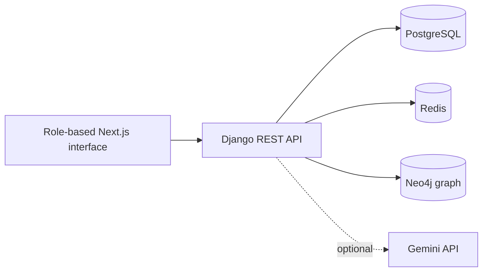

# SecureMed

SecureMed is an experimental healthcare operations platform with separate patient, doctor, laboratory, pharmacy, and administrator interfaces. It combines a Next.js frontend with a Django REST API, PostgreSQL, Redis, and an optional Neo4j graph for infection-tracing experiments.

> SecureMed is not a certified medical device, electronic health-record product, emergency service, or production clinical system. The repository is suitable for software research and local demonstrations only; it must not be used for real patient care or protected health information without a formal security, privacy, safety, and regulatory programme.

## Implemented areas

- Invitation-based accounts, JWT sessions, TOTP MFA, recovery codes, and password reset
- Role-specific routes for patients, doctors, pharmacists, laboratory staff, and administrators
- Patient profiles, consent records, access logs, and account-deletion requests
- Appointments, doctor availability, referrals, and reminders
- Medical records, prescriptions, digital-signature checks, lab orders, and medication-interaction data
- Telemedicine rooms, messaging, and triage requests
- Billing records and insurance-verification demonstrations
- Audit logs, emergency-access records, and policy-acceptance receipts
- Optional infection-contact graph and risk computation through Neo4j
- Optional Gemini-assisted endpoints that degrade when no API key is configured

## Architecture



## Run with Docker

Requirements: Docker Engine and Docker Compose v2.

Create a root `.env` with non-default development secrets:

```text
DB_NAME=securemed
DB_USER=postgres
DB_PASSWORD=replace-this-database-password
REDIS_PASSWORD=replace-this-redis-password
SECRET_KEY=replace-this-django-secret
DEBUG=False
```

Then start the stack:

```bash
docker compose up --build
```

Open:

- Frontend: `http://localhost:3000`
- Backend: `http://localhost:8000`
- API health: `http://localhost:8000/health/`
- Swagger UI: `http://localhost:8000/api/docs/`
- ReDoc: `http://localhost:8000/api/redoc/`

The Compose stack keeps PostgreSQL, Redis, and Neo4j on an internal network. Its default credentials are for local development and must be replaced before any shared deployment.

## Manual development

Backend requirements: Python, PostgreSQL, Redis, and Neo4j when graph features are used.

```bash
cd securemed-backend
python -m venv .venv
source .venv/bin/activate
pip install -r requirements/dev.txt
cp .env.example .env
python manage.py migrate
python manage.py runserver
```

Frontend requirements: Node.js and Bun.

```bash
cd securemed-frontend
cp .env.example .env.local
bun install
bun run dev
```

The frontend uses `NEXT_PUBLIC_API_URL` for browser requests and `BACKEND_URL` for its server-side proxy.

## Verification

Backend:

```bash
cd securemed-backend
python -m pytest -q
python -m ruff check .
python manage.py makemigrations --check --dry-run
```

Frontend:

```bash
cd securemed-frontend
bun run test
bunx tsc --noEmit
bun run lint
bun run build
```

Authenticated browser tests require a running stack and seeded test users:

```bash
cd securemed-frontend
bun run cy:run
```

## Configuration

Backend settings are documented in [securemed-backend/.env.example](securemed-backend/.env.example). Important groups include:

- Django secret, debug mode, hosts, and secure-cookie behaviour
- PostgreSQL and Redis connections
- CORS and frontend URLs
- MFA and reCAPTCHA controls
- Email delivery
- Neo4j connection settings
- Optional Gemini API access

Do not commit populated `.env` files, access tokens, patient data, or production database exports.

## Documentation

- [Role model](docs/ROLES.md)
- [Disease-graph notes](docs/Graph_Disease.md)
- [Implementation chapter](docs/chapter5_implementation.md)
- [Backend API notes](securemed-backend/docs/API_DOCS.md)
- [Backend run guide](securemed-backend/docs/RUN_GUIDE.md)
- [Security-hardening notes](securemed-backend/SECURITY_HARDENING.md)
- [HODDI data import](securemed-backend/docs/HODDI_IMPORT.md)

## Security and safety boundaries

The code includes role checks, consent records, MFA, password reset, emergency-access logging, security headers, rate limiting, and audit events. Those controls are not proof of HIPAA, GDPR, ABDM, or any other regulatory compliance.

A real deployment would still require threat modelling, independent security testing, clinical safety review, data classification, encryption and key management, immutable logging, backup and disaster recovery, retention and deletion policy, incident response, vendor review, staff training, and jurisdiction-specific legal approval.

## Known limitations

- Demonstration and seed data are not representative clinical datasets.
- Several integrations and workflows are prototypes rather than validated hospital processes.
- Optional AI output must be reviewed by a qualified clinician and must never be treated as diagnosis or treatment advice.
- Infection-risk scoring is experimental and depends on the completeness and accuracy of graph data.
- Automated tests do not establish clinical safety, privacy compliance, or production availability.
- Local container defaults are not production configuration.
