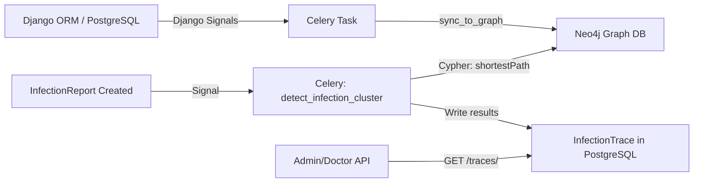

# Infection Tracking System — Neo4j Graph + Celery + BFS/Dijkstra

## The Problem

Hospitals need to trace how infections spread between patients. When two patients are diagnosed with the same rare infection within 48 hours, we need to find the transmission vector — the shared doctor, room, or equipment that connected them.

## Why Neo4j Instead of networkx
### 4. Recursive Drug-Interaction Graph (Advanced Database Queries)

**The Problem:** Standard pharmacy software only checks if Drug A interacts with Drug B. It fails to catch systemic cascades (e.g., Drug A depletes Enzyme X; Enzyme X is required to process Drug B; Drug B builds up and becomes toxic). **The Feature:** Model the human body's metabolic pathways as a **Graph** (either using PostgreSQL Recursive Common Table Expressions (CTEs) or Python's NetworkX library). **The Demo:** A doctor prescribes 5 different, seemingly safe medications. Your backend algorithm traverses the metabolic graph. It detects that while none of the drugs interact directly, their combined effect on a specific liver pathway will cause a delayed toxicity cascade. It flags this deep, multi-level interaction. **Why it wins:** It demonstrates mastery over **Graph Theory** and complex, recursive database querying. Designing a system that can traverse relationships to find non-obvious conclusions is a hallmark of elite software architecture.

| | networkx | **Neo4j** |
|---|---|---|
| Storage | In-memory, rebuilt every time | Persistent graph database |
| Scale | Chokes past ~100K nodes | Billions of nodes + relationships |
| Query language | Python API only | **Cypher** — declarative graph query language |
| Pathfinding | Manual BFS/Dijkstra code | Built-in `shortestPath()`, weighted Dijkstra via GDS |
| Visualization | None | Neo4j Browser — visualize infection chains directly |
| Production-ready | Library | Database with ACID transactions |

This shows polyglot persistence (PostgreSQL for OLTP + Neo4j for graph analytics), which is exactly the kind of architecture decision that stands out.

## Architecture



**Flow:**
1. Appointments and room visits are synced to Neo4j as nodes + relationships via Celery tasks (triggered by Django signals)
2. When an `InfectionReport` is created, a Celery task checks if another patient has the same infection within 48 hours
3. If a cluster is found, it runs `shortestPath` in Neo4j to find the transmission chain
4. Results are stored as `InfectionTrace` records in PostgreSQL and exposed via API

## Proposed Changes

### Infrastructure

#### [MODIFY] [docker-compose.yml](file:///home/anuruprkris/Project/SecureMed/securemed-backend/docker-compose.yml)
- Add Neo4j service with `neo4j:5-community` image
- Expose ports 7474 (browser) and 7687 (bolt)
- Add volume for Neo4j data persistence

#### [MODIFY] [settings.py](file:///home/anuruprkris/Project/SecureMed/securemed-backend/config/settings.py)
- Add `NEO4J_URI`, `NEO4J_USER`, `NEO4J_PASSWORD` settings (read from env)
- Add `apps.clinical.infection_tracking` to `INSTALLED_APPS`

#### [MODIFY] [requirements.txt](file:///home/anuruprkris/Project/SecureMed/securemed-backend/requirements.txt)
- Add `neo4j>=5.0.0` (official Neo4j Python driver)

#### [MODIFY] [.env](file:///home/anuruprkris/Project/SecureMed/securemed-backend/.env)
- Add `NEO4J_URI`, `NEO4J_USER`, `NEO4J_PASSWORD` defaults

#### [MODIFY] [.env.example](file:///home/anuruprkris/Project/SecureMed/securemed-backend/.env.example)
- Document Neo4j environment variables

---

### New Domain: `apps/clinical/infection_tracking/`

#### [NEW] [models.py](file:///home/anuruprkris/Project/SecureMed/securemed-backend/apps/clinical/infection_tracking/models.py)

Three models:

**`Room`** — Physical locations where patient encounters happen
- `room_id` (CharField, unique) — e.g. "MRI-1", "ICU-4", "WARD-2B"
- `name` (CharField) — "MRI Suite 1"
- `room_type` (CharField, choices) — "examination", "imaging", "icu", "ward", "operating", "lab"
- `department` (FK → Department)
- `floor`, `building` (from Department or override)
- `is_active`, `created_at`

**`InfectionReport`** — When a patient is diagnosed with an infection
- `report_id` (CharField, unique)
- [patient](file:///home/anuruprkris/Project/SecureMed/securemed-backend/apps/scheduling/appointments/views.py#274-309) (FK → Patient)
- `infection_name` (CharField) — "MRSA", "C. difficile", "VRE", etc.
- `infection_code` (CharField) — ICD-10 code
- `diagnosed_at` (DateTimeField) — exact diagnosis timestamp
- `severity` (CharField, choices) — "mild", "moderate", "severe", "critical"
- `notes` (TextField)
- `reported_by` (FK → User)
- `created_at`

**`InfectionTrace`** — Results of the graph pathfinding
- `trace_id` (CharField, unique)
- `source_report` (FK → InfectionReport) — patient A's report
- `target_report` (FK → InfectionReport) — patient B's report
- `infection_name` (CharField)
- `transmission_path` (JSONField) — serialized path: `[{type: "patient", id: 1}, {type: "room", id: "MRI-1", overlap_time: "..."}, {type: "doctor", id: 5}, ...]`
- `path_length` (IntegerField) — hops in the graph
- `confidence_score` (FloatField) — weighted by time proximity
- `vector_type` (CharField) — "shared_room", "shared_doctor", "shared_equipment", "indirect"
- `detected_at` (DateTimeField, auto)
- `status` (CharField) — "detected", "investigating", "confirmed", "dismissed"
- `investigated_by` (FK → User, nullable)

#### [NEW] [graph_service.py](file:///home/anuruprkris/Project/SecureMed/securemed-backend/apps/clinical/infection_tracking/graph_service.py)

The core engine. A `HospitalGraphService` class that:
- Manages the Neo4j driver connection (singleton pattern)
- **`sync_patient(patient_id)`** — Creates/updates a Patient node in Neo4j
- **`sync_doctor(doctor_id)`** — Creates/updates a Doctor node
- **`sync_room(room_id)`** — Creates/updates a Room node
- **`sync_appointment(appointment_id)`** — Creates relationships:
  - [(Patient)-[:VISITED {date, time}]->(Room)](file:///home/anuruprkris/Project/SecureMed/securemed-backend/apps/accounts/users/models.py#99-107)
  - [(Doctor)-[:ATTENDED {date, time}]->(Room)](file:///home/anuruprkris/Project/SecureMed/securemed-backend/apps/accounts/users/models.py#99-107)
  - [(Patient)-[:SAW {date, time}]->(Doctor)](file:///home/anuruprkris/Project/SecureMed/securemed-backend/apps/accounts/users/models.py#99-107)
- **`find_transmission_path(patient_a_id, patient_b_id, time_window_hours=72)`** — Runs Cypher `shortestPath` between two patients, filtering by time overlaps within the window
- **`find_cluster(infection_name, hours=48)`** — Finds all patients with the same infection within `hours`, returns connected components
- **`get_high_risk_rooms(days=7)`** — Returns rooms with the most cross-patient traffic (centrality analysis)

Example Cypher for shortest path:
```cypher
MATCH path = shortestPath(
  (a:Patient {patient_id: $patient_a})-[*..6]-(b:Patient {patient_id: $patient_b})
)
WHERE ALL(r IN relationships(path) WHERE r.date >= $start_date AND r.date <= $end_date)
RETURN path
```

#### [NEW] [tasks.py](file:///home/anuruprkris/Project/SecureMed/securemed-backend/apps/clinical/infection_tracking/tasks.py)

Celery tasks:
- **`sync_appointment_to_graph(appointment_id)`** — Called after appointment creation/completion, syncs to Neo4j
- **`detect_infection_cluster(report_id)`** — Triggered when InfectionReport is created:
  1. Query PostgreSQL for other patients with same infection within 48 hours
  2. For each pair, run `find_transmission_path` in Neo4j
  3. Create `InfectionTrace` records with the results
- **`rebuild_graph()`** — Full resync: wipes Neo4j and rebuilds from all historical appointments (scheduled via Celery Beat, runs nightly)
- **`compute_room_risk_scores()`** — Periodic task: calculates which rooms have highest cross-contamination risk

#### [NEW] [signals.py](file:///home/anuruprkris/Project/SecureMed/securemed-backend/apps/clinical/infection_tracking/signals.py)

Django signals:
- `post_save` on [Appointment](file:///home/anuruprkris/Project/SecureMed/securemed-backend/apps/scheduling/appointments/models.py#7-47) (status = "completed") → triggers `sync_appointment_to_graph.delay()`
- `post_save` on `InfectionReport` → triggers `detect_infection_cluster.delay()`

#### [NEW] [serializers.py](file:///home/anuruprkris/Project/SecureMed/securemed-backend/apps/clinical/infection_tracking/serializers.py)

DRF serializers for `Room`, `InfectionReport`, `InfectionTrace`

#### [NEW] [views.py](file:///home/anuruprkris/Project/SecureMed/securemed-backend/apps/clinical/infection_tracking/views.py)

ViewSets following existing patterns:
- **`RoomViewSet`** — CRUD for rooms (admin only)
- **`InfectionReportViewSet`** — Create/list infection reports (doctors/admins)
  - Custom action `@action(detail=True) traces` — get all traces for a report
- **`InfectionTraceViewSet`** — Read-only traces (admin/doctor)
  - Custom action `@action(detail=False) active_clusters` — get all currently active infection clusters
  - Custom action `@action(detail=False) high_risk_rooms` — rooms with highest risk scores
- **`GraphSyncViewSet`** — Admin endpoint to trigger manual graph rebuild

#### [NEW] [urls.py](file:///home/anuruprkris/Project/SecureMed/securemed-backend/apps/clinical/infection_tracking/urls.py)

Router registration matching existing patterns

#### [NEW] [apps.py](file:///home/anuruprkris/Project/SecureMed/securemed-backend/apps/clinical/infection_tracking/apps.py)

AppConfig with `ready()` to connect signals

#### [NEW] [admin.py](file:///home/anuruprkris/Project/SecureMed/securemed-backend/apps/clinical/infection_tracking/admin.py)

Django admin registration for Room, InfectionReport, InfectionTrace

---

### Existing Model Changes

#### [MODIFY] [appointments/models.py](file:///home/anuruprkris/Project/SecureMed/securemed-backend/apps/scheduling/appointments/models.py)

Add optional `room` FK to [Appointment](file:///home/anuruprkris/Project/SecureMed/securemed-backend/apps/scheduling/appointments/models.py#7-47):
```python
room = models.ForeignKey(
    'infection_tracking.Room',
    on_delete=models.SET_NULL,
    null=True, blank=True,
    related_name='appointments'
)
```

---

### URL Wiring

#### [MODIFY] [config/urls.py](file:///home/anuruprkris/Project/SecureMed/securemed-backend/config/urls.py)

Add to `api_patterns`:
```python
path('infection-tracking/', include('apps.clinical.infection_tracking.urls')),
```

---

## Verification Plan

### Automated Tests

#### [NEW] [tests/test_infection_tracking.py](file:///home/anuruprkris/Project/SecureMed/securemed-backend/tests/test_infection_tracking.py)

Tests covering:
1. **Model tests** — Room, InfectionReport, InfectionTrace creation and constraints
2. **Graph service tests** — Neo4j sync operations and pathfinding (requires Neo4j running)
3. **API tests** — CRUD endpoints, permissions (doctors can create reports, admins can view traces)
4. **Signal tests** — Verify signals trigger correct Celery tasks
5. **Cluster detection tests** — Two patients with same infection within 48h triggers trace

Run with:
```bash
cd /home/anuruprkris/Project/SecureMed/securemed-backend
docker compose up -d db redis neo4j
pytest tests/test_infection_tracking.py -v
```

### Manual Verification

1. **Neo4j Browser** — After syncing data, open `http://localhost:7474` and visually verify the graph structure with Cypher queries like `MATCH (n) RETURN n LIMIT 50`
2. **API smoke test** — Create rooms via API, create an infection report, verify trace is generated
3. **Docker services** — Verify all services (db, redis, neo4j, backend, celery) start correctly with `docker compose up`
