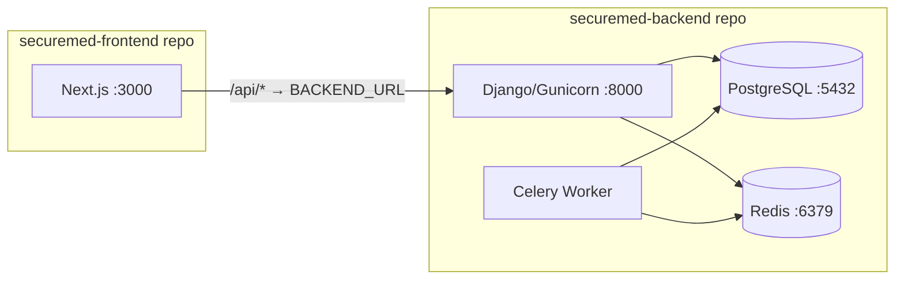

# Dockerize SecureMed — Multi-Repo Setup

Each repo (`securemed-backend` and `securemed-frontend`) gets its **own** `Dockerfile` + `docker-compose.yml` so they can be developed, built, and deployed independently.

## Architecture



> [!IMPORTANT]
> The backend compose includes **PostgreSQL** and **Redis** as services.
> The frontend compose is standalone and connects to the backend via `BACKEND_URL` env var (defaults to `http://host.docker.internal:8000` for local dev).

---

## Proposed Changes

### Backend — `securemed-backend/`

#### [NEW] [Dockerfile](file:///home/anuruprkris/Project/SecureMed/securemed-backend/Dockerfile)

Multi-stage build:
- **Stage 1 (builder)**: `python:3.13-slim`, install deps from [requirements.txt](file:///home/anuruprkris/Project/SecureMed/securemed-backend/requirements.txt)
- **Stage 2 (runtime)**: copy installed packages, app code, collect static files
- Runs `gunicorn config.wsgi:application` on port `8000`

#### [NEW] [docker-compose.yml](file:///home/anuruprkris/Project/SecureMed/securemed-backend/docker-compose.yml)

Services:
| Service | Image | Port | Notes |
|---------|-------|------|-------|
| `db` | `postgres:16-alpine` | 5432 | Named volume `postgres_data` |
| `redis` | `redis:7-alpine` | 6379 | — |
| `backend` | build `.` | 8000 | Depends on `db`, `redis` |
| `celery` | same image | — | `celery -A config worker` |

#### [NEW] [.dockerignore](file:///home/anuruprkris/Project/SecureMed/securemed-backend/.dockerignore)

Excludes `.venv/`, `venv/`, `.git/`, `__pycache__/`, `media/`, `staticfiles/`, etc.

#### [NEW] [.env.example](file:///home/anuruprkris/Project/SecureMed/securemed-backend/.env.example)

Template with all required env vars for Docker (DB_HOST=db, etc.)

---

### Frontend — `securemed-frontend/`

#### [NEW] [Dockerfile](file:///home/anuruprkris/Project/SecureMed/securemed-frontend/Dockerfile)

Multi-stage build:
- **Stage 1 (deps)**: `oven/bun:1` — install deps via `bun install --frozen-lockfile`
- **Stage 2 (builder)**: copy deps, build with `bun run build`
- **Stage 3 (runner)**: `node:22-alpine` — copy standalone output, run `node server.js` on port `3000`

#### [NEW] [docker-compose.yml](file:///home/anuruprkris/Project/SecureMed/securemed-frontend/docker-compose.yml)

Services:
| Service | Image | Port | Notes |
|---------|-------|------|-------|
| `frontend` | build `.` | 3000 | `BACKEND_URL` defaults to `http://host.docker.internal:8000` |

#### [NEW] [.dockerignore](file:///home/anuruprkris/Project/SecureMed/securemed-frontend/.dockerignore)

Excludes `node_modules/`, `.next/`, `.git/`, etc.

#### [NEW] [.env.example](file:///home/anuruprkris/Project/SecureMed/securemed-frontend/.env.example)

Template with `BACKEND_URL` and `NEXT_PUBLIC_API_URL`.

---

## Verification Plan

### Automated Tests

1. **Backend container starts and connects to DB**:
   ```bash
   cd securemed-backend
   docker compose up -d --build
   docker compose exec backend python manage.py check
   docker compose exec backend python manage.py migrate --check
   ```

2. **Frontend container starts**:
   ```bash
   cd securemed-frontend
   docker compose up -d --build
   curl -s -o /dev/null -w "%{http_code}" http://localhost:3000
   # Expect: 200
   ```

3. **API proxy works end-to-end** (both composes running):
   ```bash
   curl http://localhost:3000/api/health/
   # Should reach the Django backend
   ```

### Manual Verification
- Open `http://localhost:3000` in a browser and confirm the frontend loads.
- Confirm `docker compose logs backend` shows no errors.
